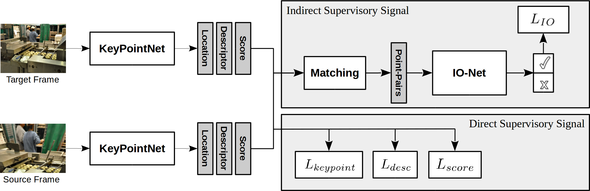
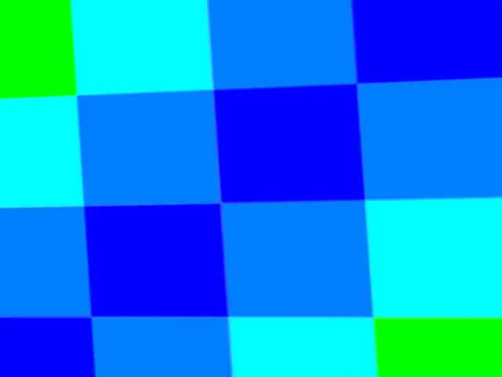
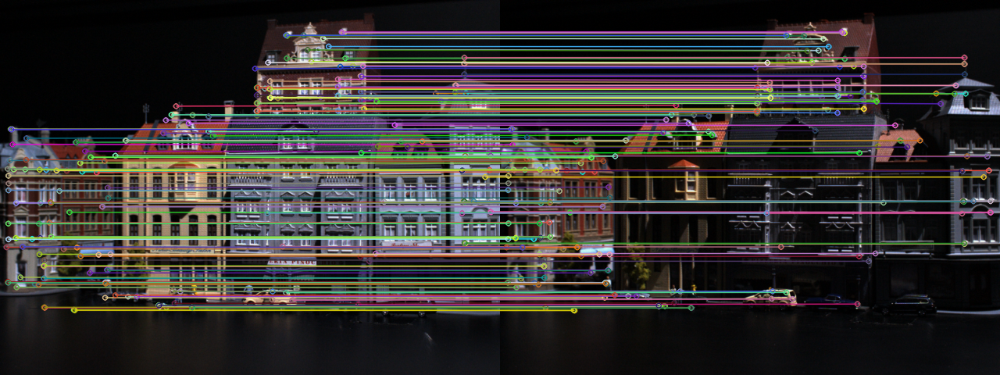
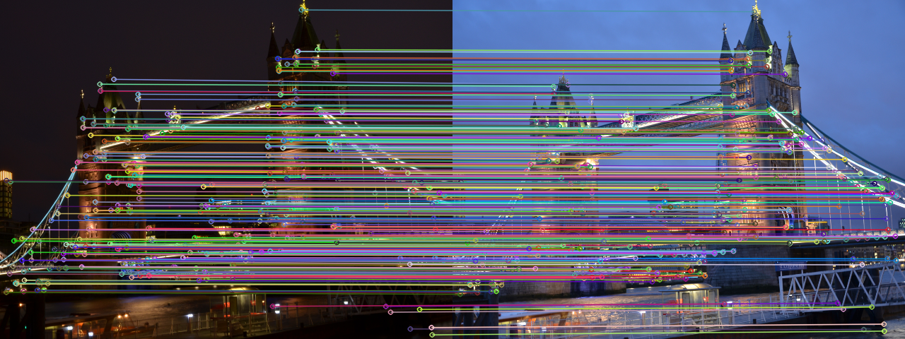
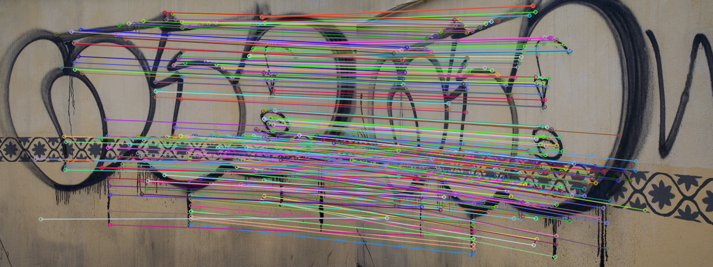
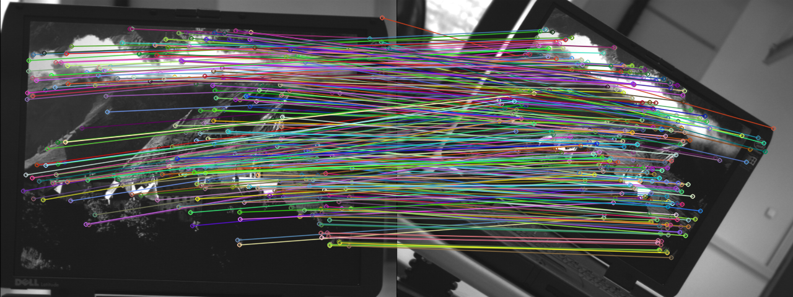
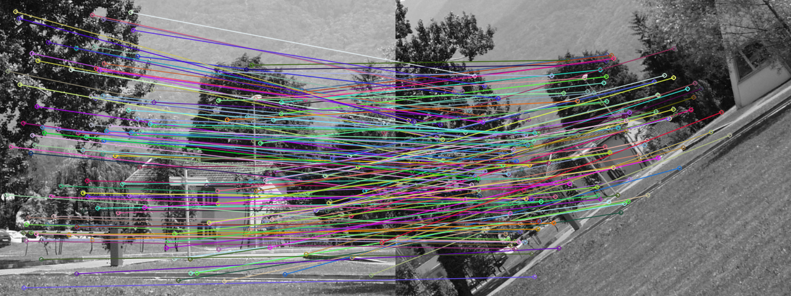

# Neural Outlier Rejection for Self-Supervised Keypoint Learning
Code coming soon.

## Overview

- **IO-Net:** A novel proxy task for the self-supervision of keypoint description. 
- **KeyPointNet:**  An improved keypoint-network architecture that is especially amenable to robust keypoint detection and description.

[**[Full paper]**](https://openreview.net/pdf?id=Skx82ySYPH)

## Over-fitting Examples

- **Toy example:**
<p align="center">
  
  
  
</p>

- **TRI example:**
<p align="center">
  
  
  
</p>

## Qualatitive Results

- **Illumination Cases:**

<p align="center">
  
  
</p>

- **Perspective Cases:**
<p align="center">
  
  
</p>

- **Rotation Cases:**
<p align="center">
  
  
</p>

## Citation
Please use the following citation when referencing our work:
```
@inproceedings{
tang2020neural,
title={Neural Outlier Rejection for Self-Supervised Keypoint Learning},
author={Jiexiong Tang and Hanme Kim and Vitor Guizilini and Sudeep Pillai and Rares Ambrus},
booktitle={International Conference on Learning Representations},
year={2020}
}
```
